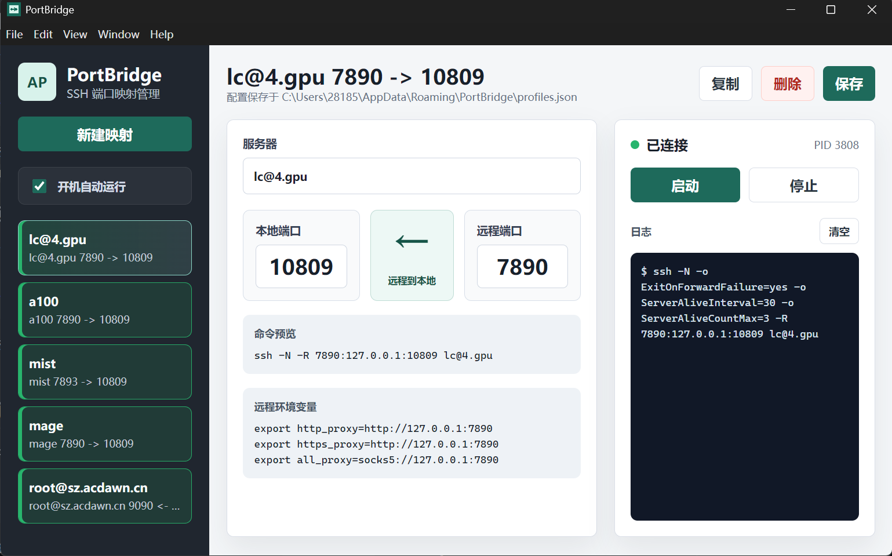

# PortBridge

PortBridge 是一个用于管理 SSH 端口隧道的小型 Electron 桌面应用。它把常用的 `ssh -N -L` 和 `ssh -N -R` 命令做成可视化配置，适合需要频繁开启本地转发、远程转发、反向代理端口映射的场景。



## 功能

- 管理多组 SSH 端口映射配置
- 支持本地到远程和远程到本地两种方向
- 一键启动、停止 SSH 隧道
- 显示当前连接状态、PID 和 SSH 输出日志
- 连接断开后自动重连
- 支持最小化到托盘
- 支持开机自动启动
- 配置持久化保存到用户数据目录

## 映射方向

PortBridge 目前支持两种 SSH 隧道方向。

### 远程到本地

对应 SSH 命令：

```bash
ssh -N -R <远程端口>:127.0.0.1:<本地端口> <服务器>
```

适合把本机服务暴露给远程服务器使用。例如本机 `127.0.0.1:10809` 有代理服务，希望远程服务器通过 `127.0.0.1:7890` 访问它。

### 本地到远程

对应 SSH 命令：

```bash
ssh -N -L <本地端口>:127.0.0.1:<远程端口> <服务器>
```

适合在本机访问远程服务器上的服务。例如远程服务器 `127.0.0.1:9090` 有服务，希望本机通过 `127.0.0.1:9090` 访问它。

## 使用前准备

确保系统中已经安装并可以直接运行 `ssh`：

```bash
ssh -V
```

并确保你的 SSH 目标可以免交互连接，推荐提前配置好 `~/.ssh/config` 或 SSH key。例如：

```bash
ssh my-server
```

如果这里需要输入密码、确认指纹或报错，PortBridge 启动隧道时也会遇到同样的问题。

## 开发运行

安装依赖：

```bash
npm install
```

启动应用：

```bash
npm start
```

或：

```bash
npm run dev
```

## 配置位置

配置文件保存为：

```text
%APPDATA%\PortBridge\profiles.json
```

在当前 Windows 用户下通常是：

```text
C:\Users\<用户名>\AppData\Roaming\PortBridge\profiles.json
```

应用会从旧版本的 `auto-proxy` 配置目录迁移已有配置，避免改名后丢失原来的映射。

## 开机自动启动

在应用左侧勾选“开机自动运行”后，PortBridge 会注册到系统登录项。开机启动时应用会隐藏窗口并保留托盘图标，需要打开主窗口时点击托盘菜单即可。

## 常见问题

### 启动后配置不见了

PortBridge 使用固定的用户数据目录保存配置，不依赖当前工作目录。如果是从旧版本升级，应用会自动迁移旧配置。你也可以查看界面中的“配置保存于”路径确认当前使用的配置文件。

### 点击启动后马上断开

常见原因包括：

- SSH 目标无法连接
- SSH key 或密码需要交互输入
- 端口已被占用
- 远程服务器未允许 TCP 转发
- 远程转发时服务器未允许对应的 `AllowTcpForwarding` 或 `GatewayPorts` 配置

可以先复制界面中的命令预览，在终端中手动运行，确认 SSH 本身是否可用。

### 为什么会自动重连

PortBridge 启动 SSH 隧道时会保持进程状态。如果进程异常退出，应用会等待一小段时间后自动重连，并在日志中记录退出原因。

## 项目结构

```text
src/
  main.js              Electron 主进程，负责窗口、托盘、配置读写和 SSH 进程
  preload.js           安全暴露给渲染进程的 IPC API
  renderer/
    index.html         应用界面
    renderer.js        前端状态和交互逻辑
    styles.css         界面样式
assets/                应用图标和托盘图标
scripts/               辅助脚本
```

## License

当前项目暂未声明许可证。
